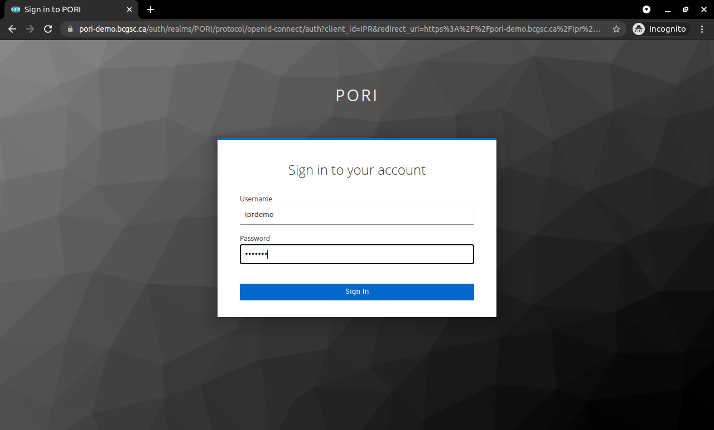
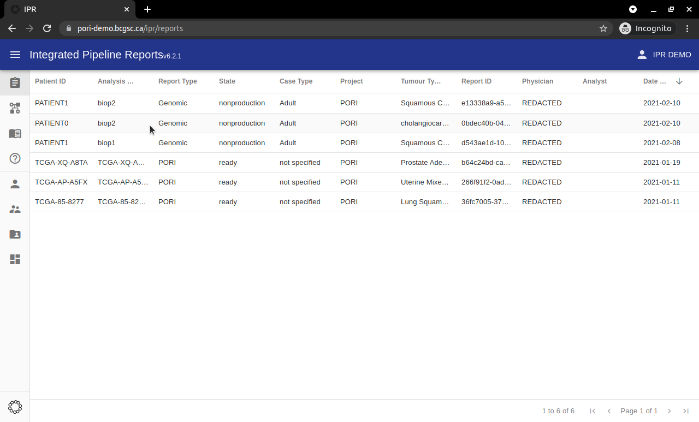

# Demo

A live demo of the platform is found under `pori-demo.bcgsc.ca`. This demo was deployed via docker-compose.

!!! Info "Some Features are Not Available in the Demo Application"

    These include all write operations as well as the automated linking between the kb-matches page in IPR and the GraphKB statements.

!!! Info "Data in the Demo is Limited"

    The data provided in the demo application is a subset of what you might use in your own production application of PORI. The GraphKB data contains partial copies of various open data sets for demonstrative purposes only. This demo should not be used to annotate your own reports. Instead please see the [install section](./install.md) for instructions on setting up and deploying your own instance of PORI.

## Videos

We have recorded videos on various sections of IPR from the analysts perspective to help new users in navigating the system.

- [Landing Page](https://vimeo.com/582124704/8559a53557)
- [Report Summary Page](https://vimeo.com/582124225/0e987a1fcf)
- [Therapeutic Options Table](https://vimeo.com/467920834/21997511d0)
- [Pathway Analysis](https://vimeo.com/582126313/0653a515c9)

## IPR

The demo instance of IPR is at [pori-demo.bcgsc.ca/ipr](https://pori-demo.bcgsc.ca/ipr). This will bring you to the login page of the IPR client application. Use the following credentials to log in to the demo application

- username: `iprdemo`
- password: `iprdemo`

When you first go to the link above it will redirect you to the keycloak login page. Enter the above credentials

Once you are logged in you will be brought to the main report listing page. This is a table of all the reports your user has access to in IPR. The table can be sorted and filtered.

By clicking on a row in the above table you will be brought to the corresponding reports main summary page. Once in the report view, the different sections of the report can be navigated via the right-hand side bar.

## GraphKB

The demo instance of IPR is at [pori-demo.bcgsc.ca/graphkb](https://pori-demo.bcgsc.ca/graphkb). This will bring you to the login page of the GraphKB client application. The iprdemo credentials will also work with GraphKB to demonstrate single sign on. However, we also provide an admin demo account for GraphKB so that users can explore the admin-only sections of the application. The credentials for the administrative account are

- username: `graphkb_admin`
- password: `graphkb_admin`

## APIs

If you are a developer looking for a demo of the APIs for GraphKB and IPR their documentation can be found here

- [IPR OpenAPI Spec](https://pori-demo.bcgsc.ca/ipr-api/api/spec/)
- [GraphKB OpenAPI Spec](https://pori-demo.bcgsc.ca/graphkb-api/api/spec) ([swagger version](https://pori-demo.bcgsc.ca/graphkb-api/api/spec/swagger))
