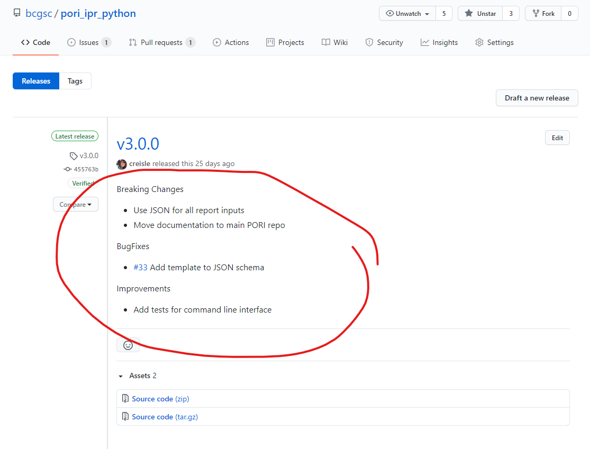

# Contributing Guidelines

If you are new to PORI and would like to contribute, writing tests and documentation is a great way to familiarize yourself with the project. An overview of our developer guidelines and best practices is given below.

## Tests

When new features are added, corresponding tests should be implemented as well. We use [jest](https://jestjs.io/) for both API and client testing. The client additionally uses [React Testing Library](https://testing-library.com/docs/react-testing-library/intro/). Tests for python adpators are written using [pytest](https://docs.pytest.org/en/6.2.x/).

Tests for all repositories will be automatically run as a part of their [GitHub Actions](https://github.com/features/actions) plan. See the next section for more details.

## CI / CD

Every PORI repository has a corresponding github actions plan. These plans automate running tests, testing that documentation will build, as well as building and deploying docker containers when relevant. In general the following patterns are used.

### On Push

- tests are run
- docker containers are built to test they can build without errors
- linting / style-checking is performed

### On Release

- Python Adaptors are published to [PyPI](https://pypi.org/project/pip/)
- Docker containers are published to [DockerHub](https://hub.docker.com/)

## Documentation

Documentation is critical both for the developers and the users.

### Docstrings / Function Documentation

Functions should contain docstrings. The most important part here is the short description of the purpose of the function.

#### Python

In python these use the [Google style](http://google.github.io/styleguide/pyguide.html#38-comments-and-docstrings) docstrings. These will be automatically parsed to include in the developer reference section of this site by the [markdown_refdocs](https://github.com/creisle/markdown_refdocs/) package. Any variables that are not self explanatory (ex. `input_file_path`) should include a parameter description as well. Types do not need to be included where a [typing annotation](https://docs.python.org/3/library/typing.html) has been added in the function signature.

Example of a well documented function

```python
def positions_overlap(
    pos_record: BasicPosition, range_start: BasicPosition, range_end: Optional[BasicPosition] = None
) -> bool:
    """
    Check if 2 Position records from GraphKB indicate an overlap

    Note:
        null values indicate not-specified or any

    Args:
        pos_record: the record to compare
        range_start: the position record indicating the start of an uncertainty range
        range_end: the position record indicating the end of an uncertainty range

    Raises:
        NotImplementedError: if a cytoband type position is given

    Returns:
        True if the positions overlap
    """
```

#### Javascript / TypeScript

We also use docstrings here. However in contrast to python these are immediately outside the function instead of following the function definition. These docstrings follow [JSDoc](https://jsdoc.app/) syntax.

If types are included (typescript) in the code then the types can be omitted from the docstring itself.

An example of a well documented function is given below

```js
/**
 * Convert parsed breakpoints into a string representing the breakpoint range
 *
 * @param {Position} start the start of the breakpoint range
 * @param {Position} [end=null] the end of the breakpoint range (if the breakpoint is a range)
 * @param {boolean} [multiFeature=false] flag to indicate this is for multi-feature notation and should not contain brackets
 *
 * @returns {string} the string representation of a breakpoint or breakpoint range including the prefix
 */
const breakRepr = (start, end = null, multiFeature = false) => {
```

### User Documentation

The user documentation should be updating in the [central PORI documentation repository (this repository)](https://github.com/bcgsc/pori/) when any changes are made which will affect the users. Furthermore all releases should contain a summary of the major and minor changes in their release tag for users who may be following the github page.

## Code Style

In general we try to use automated tools to enforce code style. This helps avoid adding extra work on the developers and also makes the style choices transparent and consistent. For javascript/typescript we use [ESLint](https://eslint.org/) to enforce compliance. For python files we use [Black](https://github.com/psf/black). These checks are generally run and included in the automated builds.

## Branching Model

We use a fairly standard branching model which includes a base development branch (develop) and a stable main branch (master). Feature and bugfix branches are created off develop. Release braches are created off develop (or master for a quick/hotfix) and then a PR is made to master.


**image credit**: [A successful Git branching model](https://nvie.com/posts/a-successful-git-branching-model/).

Following a release, the master branch is merged back into the development branch.

## Releases

### General Release Process

In the following running example we are making the release v5.2.0

1. Make a release branch off develop

    ```bash
    git checkout develop
    git pull
    git checkout -b release/v5.2.0
    git push --set-upstream origin release/v5.2.0
    ```

2. Edit the version files (see [Versioning](#versioning) below)
3. Set up a pull request (PR) from the Release Branch to the Master Branch

    The PR description should match what the upcoming release notes will be. This gives the reviewers a chance to review the release notes as part of the PR review

4. Once Approved and Merged, Tag a Release on Master (See [Release Notes](#release-notes))
5. Finally, Make a PR from master to develop. This should just be called something like "master back to dev" and does not require a description

### Versioning

Each project in PORI uses [semantic versioning](https://semver.org/). For python projects this should be written in the setup.py script

```python
setup(
    version='X.X.X',
)
```

And for javascript/typescript projects it will be found in the package.json/package-lock.json files

```json
{
    "version": "X.X.X",
}
```

Version for both will follow the

```text
<MAJOR>.<MINOR>.<PATCH>
```

pattern where

| Increment Type | Types of Changes                         | Description                                                                                                           |
| -------------- | ---------------------------------------- | --------------------------------------------------------------------------------------------------------------------- |
| MAJOR          | Breaking Changes                         | when you make incompatible API changes                                                                                |
| MINOR          | New Features or Significant Improvements | when you add functionality in a backwards-compatible manner                                                           |
| PATCH          | BugFixes or Minor/Trivial Improvements   | when you make backwards-compatible bug fixes (or other TRIVIAL changes. ex. fixing a spelling error in documentation) |

The tag (release) in github itself should begin with a v followed by the current version (ex.`v5.2.0`)

### Release Notes

Try to group changes with Major or Breaking changes at the top, followed by new features and then bugfixes and improvements. This way the content the users are likely most interested in is at the top. Release notes should be added when the release is created via the github interface and look something like this

```text
Breaking Changes
- TICKET-ID: A major breaking change

New Features
- TICKET-ID: Any additional functionality

Improvements
- TICKET-ID: Minor changes to existing functionality: ex. linting

BugFixes
- TICKET-ID: Any bugFixes
```

All releases should be created off of the master branch. An example of a release should look something like this. Note the release notes have been circled in red.


