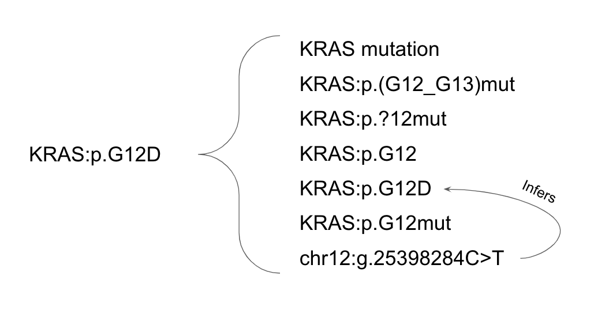

# FAQ

## How does Variant Annotation Work?

Variants are annotated using the GraphKB Python Adaptor via the GraphKB REST API. In general this
consists of the following steps

- Parse HGVS-like notation[^1]
- Disambiguate via ontologies (gene name, variant type, etc.)
- Pull matching variant records
- Refine matches base on position information[^1]
- Follows inferences (ex. g. -> p.)
- Pull statements for these variant records

[^1]: Only applicable to postional variants, these steps are skipped when matching category variants.

This allows an input like `KRAS:p.G12D` to match to all eqiuvalent forms of this variant. For example,
in the demo database it would result in the following matches

## How do I cite PORI?

Please cite the following pre-print [Reisle, et. al. 2021](https://www.biorxiv.org/content/10.1101/2021.04.13.439667v1).

## How Can I Migrate Our Existing KB to GraphKB?

The simplest way to do this is using the API. THere are a number of examples of loader/migration
scripts in the [loaders project](https://github.com/bcgsc/pori_graphkb_loader) which can be used as
examples as well as instructions on  best practices for adding or including your own. If you would like
a new loader for a public/popular resource, please make a ticket/issue on [this github space](https://github.com/bcgsc/pori_graphkb_loader/issues)

## Is there a Licensing Requirement for PORI Software?

No. PORI is fully open source. The entire platform is released under a GPL-3 open source license.

## Is there a Licensing Requirement for PORI Data?

Data is loaded and added externally by the users themselves and therefore there is no licensing requirement.
We do provided loading scripts for some externally licensed content, but it is left up to the user
to arrange and a license agreement for these sources if they would like to use them. By default the
loaders only load the open data.

## How Can I Get Involved?

We welcome and encourage community contributions! If you have a feature request, bug report, or question please feel free to submit an issue to our GitHub page. If you are not sure which repository to submit the issue to, use [this main one](https://github.com/bcgsc/pori/issues) by default and we will move or direct the issue as required.

If you are a developer and would like to directly add and work on features, please submit a ticket
for any new features and indicate that you would like to complete it or comment on an existing ticket.
Following discussion with the main developers you should fork the repository and then submit a pull request
from your forked version to the main repository.

## How Can I Try This Out?

We have created a demo version of PORI for users to test without having to set anything up. Please
see the IPR and GraphKB demos [here](https://pori-demo.bcgsc.ca)
