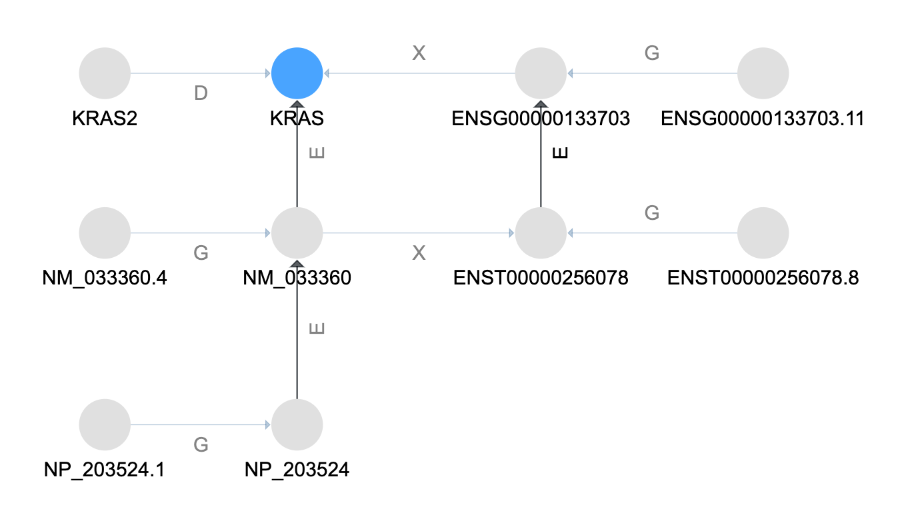
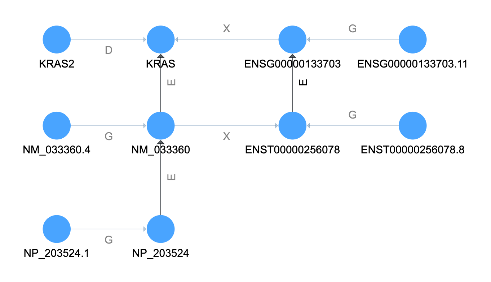

# Gene Example

The [`get_equivalent_features()`](./../reference/graphkb/match/#get_equivalent_features) method is
used to find genes *equivalent* to the input/target feature.

```python
from graphkb.match import get_equivalent_features

genes = get_equivalent_features(graphkb_conn, 'KRAS')
```

This will use a similar algorithm to what we have seen above in the disease matching example.


In the graph above the relationship types shown are: `GeneralizationOf` (G), `ElementOf` (E),
`DeprecatedBy` (D), and `CrossReferenceOf` (X).

## Match by Name

Like before, the first thing done is to match the input name



## Resolve Aliases

The next step is to resolve equivalent names of the current set of terms.


## Follow the Elements Tree

The next step is to follow the element relationships. This is treated the same as the subclassing
except now our "tree edge" is the `ElementOf` relationship type.


## Resolve Final Aliases

Finally we expand the current set of terms by alias terms again to capture aliases of the more
general parent and more specific child terms expanded in the previous step.



We have now collected all of the different terms for KRAS
