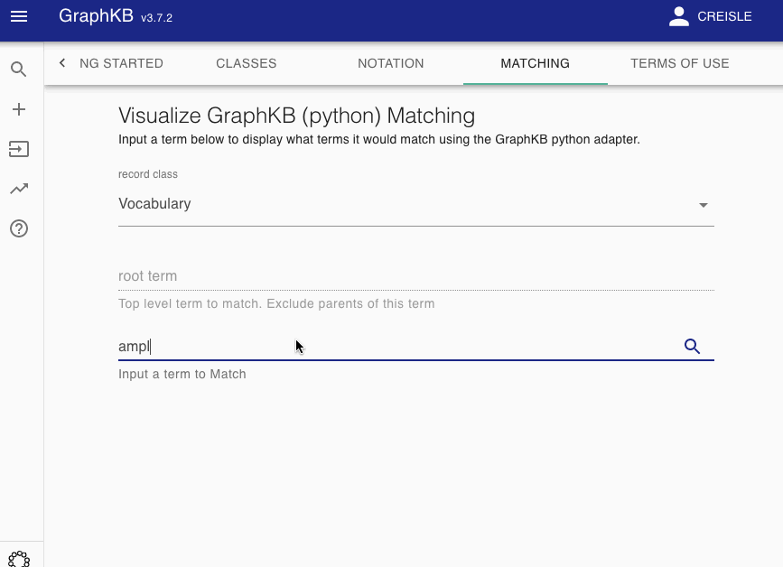

# Ontology Algorithm

The matching algorithm implemented by this adaptor heavily uses the Graph Structure of GraphKB to resolve aliases, generalisms, etc. The default behaviour of this algorithm is described below and shown in the related examples. This is primarily accomplished via the `similarTo` query type provided by the GraphKB API. This algorithm can be viewed interactively in GraphKB via the matching section of the about pages

## Definitions

The entire knowledge base is defined as the graph, $G = (V, E)$. For any given query let the
subgraph of $G$ containing only vertices of the class type specified in the query (ex. Disease)
be, $V_t$.

All edges between these vertices are then categorized into two disjoint sets: synonym-like
($E_{syn}$) or inheritance-like ($E_{inh}$). By default the synonym-like edges are:
GeneralizationOf, AliasOf, CrossReferenceOf, DeprecatedBy, and Infers. Whereas the
inheritance-like edges are: SubClassOf, and ElementOf.

!!! Note "Edge Groups are Configurable"
    These are the default division of Edges. However, classes used for the edge sets
    can be configured in the query body of similarTo type
    queries sent to GraphKB

Synonym-like edges are treated as undirected and therefore the set of synonym-like edges used for
the following steps can be written

$$
\begin{equation}
    E_\text{usyn} = \bigcup_{uv \in E_\text{syn}} \{uv,vu\}
\end{equation}
$$

Disease matching on the following graph will be used as a running example

## Match by Name

Let the set of vertices (from $V_t$) where the name attribute is an exact match to the input query
name be $V_m$.

## Resolve Aliases

Follow synonym-like edges from the set of name-matched vertices

Let $P(v_0,v,E)$ be the set of vertices that forms a path from vertex $v_0$ to
$v$ along the edges in $E$ and in their direction. If no such path exists, then $P = \emptyset$.

The set of vertices that resolve aliases in the query are formed by including all paths from
$v_0 \in V_\text{m}$ along the $E_\text{usyn}$ edges.

$$
\begin{equation}
    V_\text{syn} = V_\text{m} \cup
        \bigcup_{v_0 \in V_\text{m}} \bigcup_{ v_i \in V_\text{t} } P(v_0,v_i,E_\text{usyn})
\end{equation}
$$

## Follow the Inheritance-like Edges

The inheritance-like edges are followed next. Unlike the synonym-like edges, directionality is important here.
By following the inheritence-like edges in $E_\text{inh}$ from and to all vertices $V_\text{syn}$ we create
the set of inheritence vertices. This is the set of vertics involved in paths which originate or
terminate in a vertex perviously matched.

$$
\begin{equation}
    V_\text{inh} =  V_\text{syn} \cup
        \bigcup_{v_0 \in V_\text{syn}} \bigcup_{ v_i \in V_\text{t} } P(v_0,v_i,E_\text{inh}) \cup P(v_i,v_0,E_\text{inh})
\end{equation}
$$

## Resolve Final Aliases

Finally, we repeat the synonym-like expansion

$$
\begin{equation}
    V_\text{f} = V_\text{inh} \cup
        \bigcup_{v_0 \in V_\text{inh}} \bigcup_{ v_i \in V_\text{t} } P(v_0,v_i,E_\text{usyn})
\end{equation}
$$

## Bounding

Note that the above Graph Traversals are bounded by input parameters to specify a maximum depth.
