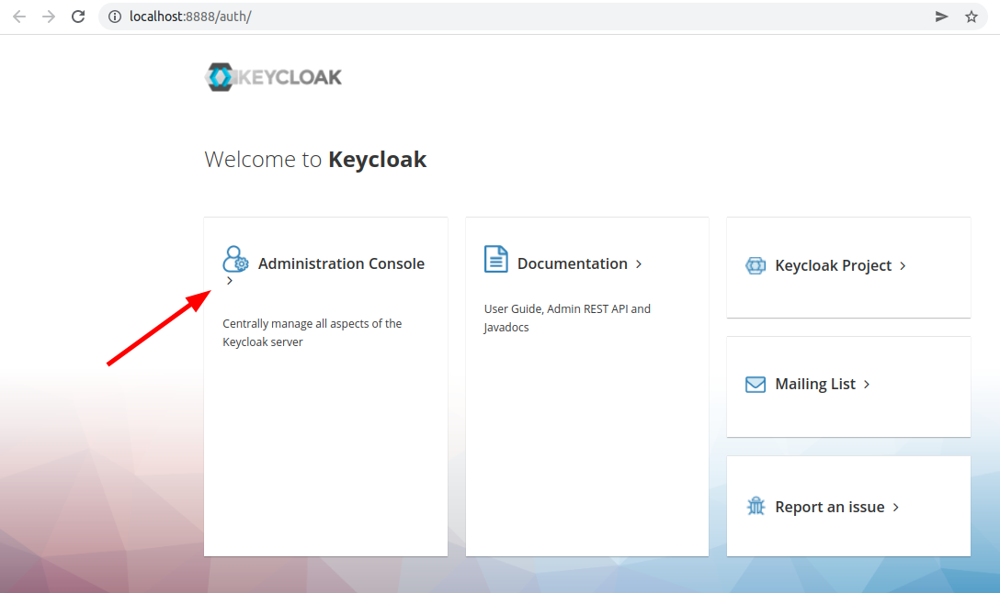
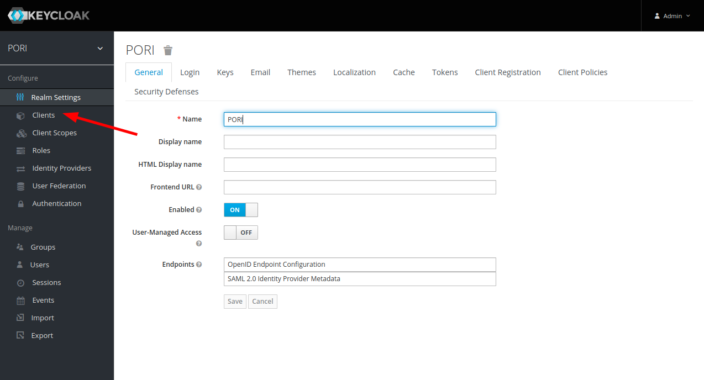
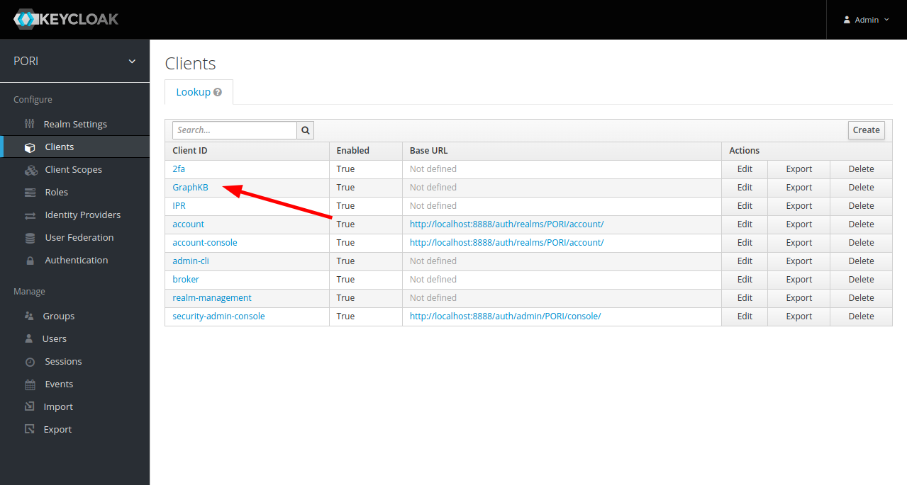
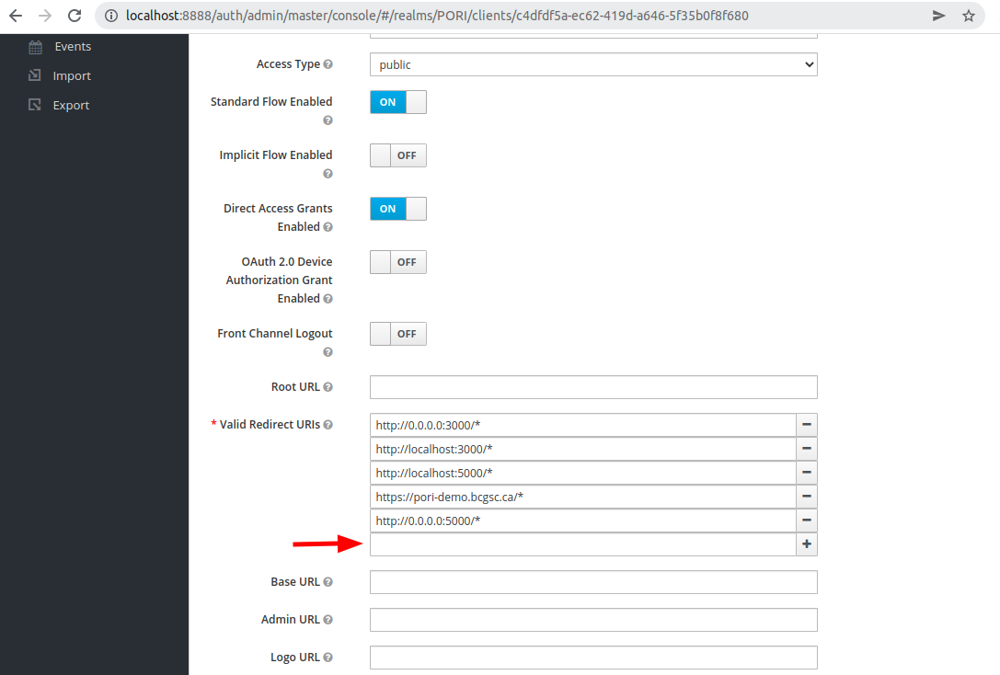

# Troubleshooting

The following page contains questions related to set up, install, and management of the PORI system.

## Keycloak

### Invalid parameter: redirect_uri

Valid redirect URIs are configured/set via the keycloak admin console. If you have set up the platform following the demo/dev instructions then you should already have the keycloak administrative console available over http. Go to http://localhost:8888/auth in your web browser and you should see something that looks like this. The user and password for this should be admin/admin for the [dev setup](https://github.com/bcgsc/pori/blob/master/docker-compose.dev.yml#L10).

Go the "Clients" in the left-hand side bar

Click on the "GraphKB" client

Scroll near the bottom on that page and you will find the "valid redirect URLs" where you need to add your host

