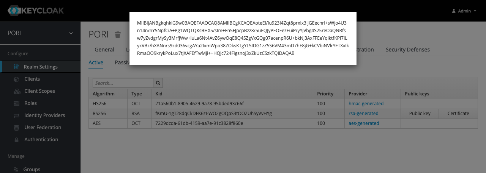

# Install with Docker

The simplest way to get the entire platform up an running from scratch is using docker. Most of the servers are auto-started together with docker-compose but the keycloak container must be started and configured on its own first. The instructions below set up the platform with HTTP and then use a reverse proxy to pick up the ports. This way you can omit the proxy step and run the platform with http when initialling setting up and testing.

Start by cloning this repository which contains the default docker compose config (docker-compose.yml)

```bash
git clone https://github.com/bcgsc/pori.git
cd pori
```

## Build the Authentication Server

The following command builds the basic keycloak container for PORI. This contains a base realm
configuration

```bash
docker build \
    -t bcgsc/pori-auth \
    -f Dockerfile.auth \
    .
```

Then you will run the container (change the password and username as desired)

```bash
docker run \
    -e KEYCLOAK_USER=admin \
    -e KEYCLOAK_PASSWORD=<PASSWORD> \
    -e KEYCLOAK_FRONTEND_URL=<URL> \
    -p 8443:8334 \
    -p 8888:8080 \
    -d \
    --mount type=bind,source=/etc/ssl/certs/current,target=/etc/x509/https,readonly \
    bcgsc/pori-auth:latest
```

For the demo server (excluding password) this looked like

```bash
docker run \
    -e KEYCLOAK_USER=admin \
    -e KEYCLOAK_PASSWORD=$DEMO_KC_ADMIN \
    -e KEYCLOAK_FRONTEND_URL=https://pori-demo.bcgsc.ca/auth \
    -p 8443:8334 \
    -p 8888:8080 \
    -d \
    --mount type=bind,source=/etc/ssl/certs/current,target=/etc/x509/https,readonly \
    bcgsc/pori-auth:latest
```

Check that the docker container has started

```bash
docker ps
```

You should see something like this

```text
CONTAINER ID   IMAGE                  COMMAND                  CREATED              STATUS              PORTS                              NAMES
16ff3826c976   bcgsc/pori-auth:latest   "/opt/jboss/tools/do…"   About a minute ago   Up About a minute   8443/tcp, 0.0.0.0:8888->8080/tcp   strange_chaum
```

After the container is started you can go to the admin console GUI to add a users and download the realm's public key file. This must be done prior to starting the other containers.

The public key file will need to be passed to the GraphKB API container at run time. Copy it from the Realms > Keys page which should look something like below



For the purposes of this example we have saved it as `keys/keycloak.key` and we will mount the keys directory to the api container in the next step. The content of the file should look something like this

```text
-----BEGIN PUBLIC KEY-----
MIIBIjANBgkqhkiG9w0BAQEFAAOCAQ8AMIIBCgKCAQEAoteEI/Iu923I4Zqt8prxIx3ljGEecnrI+sWjo4U3n14n/nY5NpfCiA+Pg1WQTQKsBHX5/sIm+Fn5FJpcpBzz8/5uEQJyPEOEezEuiP/yYjVbg4S25reOaQNRfsw7yZvdgrMySy3MrfjWw+luLa6Nt4AvZ6ywOqE8Q4SZgVxGQg07acenpR6U+bkNj3AxFFEeYqiktfKPI7iLykVBz/hXANnrs9zd036vcgAYa2IxmWpo38ZOksKTgYL5IDG1zZ5S6VM43mD7hE8jG+kCVbiNVlrYFTXxIkRmaOO9krykPoLux7tjXAFEfTwMji++HQjc724FigsnoJ3xZkUzCSzkTQIDAQAB
-----END PUBLIC KEY-----
```

Both the IPR and GraphKB API containers will use this ./keys folder, binding it into the container at run time (See volumes section of docker compose file).

You will also want to add a couple of users to make things simpler to test. If you use the non-default demo passwords (RECCOMMENDED!) you will need to change the corresponding fields in the docker compose file. The names of these users can also be changed but it will require also adding them to the application databases.

| Name             | Default in DB | Purpose                                                                                                                                              |
| ---------------- | ------------- | ---------------------------------------------------------------------------------------------------------------------------------------------------- |
| graphkb_importer | GraphKB       | This is the default user that is created when the new GraphKB DB is created. It is an admin user that can be used to add new users or import content |
| ipr_graphkb_link | GraphKB       | This is the user used by IPR to pull data from GraphKB                                                                                               |
| iprdemo          | IPR           | This is an admin user in the IPR demo db                                                                                                             |
| graphkb_admin    | GraphKB       | Admin user for managing content/users in the GraphKB web interface                                                                                   |

Add the above users to keycloak with the IPR and GraphKB roles.


## Docker-Compose

Now you are ready to start the other services. This will use the `docker-compose.yml` file to configure the network.

First create empty directories to mount the database data, this will ensure the databases are not lost when you stop/restart the container

```bash
databases/{postgres,orientdb}/{backup,data} -p
```

Next, use docker-compose to start the DB, API, and client servers. The paths/URLs in the docker-compose.yml file should be adjusted to match your deployment. In our demo deployment we have a proxy pass set up from the configured ports to handle the https layer

```bash
docker-compose up
```

This will start the following services

- Postgres db server for IPR with a default db dump
- OrientDB server for GraphKB with an empty default db
- GraphKB API server (nodejs)
- IPR API server (nodejs)
- GraphKB client server (nginx)
- IPR client server (nginx)

Once the platform is live you can populate the new GraphKB instance with external content using the [loaders](https://github.com/bcgsc/pori_graphkb_loader).
