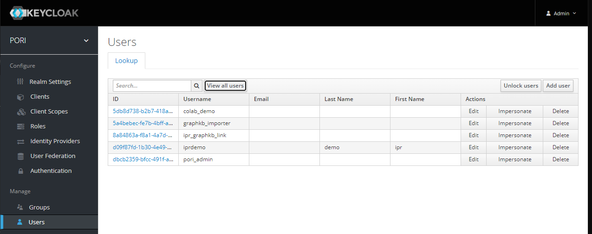

# Install with Docker

Since PORI is a production-ready, institution-level, scalable platform, the simplest way to get the entire platform up and running from scratch is using [docker](https://www.docker.com/).  For simplicity the default instructions set up the platform with http.

Most of the servers are auto-started together with docker-compose but the keycloak container must be started and configured on its own first.

!!! Note

    If this is not your first time setting up or running these instructions see the [update instructions](#updating-an-existing-demo-install) instead

Start by cloning this repository which contains the default docker compose configs (`docker-compose.yml` and `docker-compose.dev.yml`)

```bash
git clone https://github.com/bcgsc/pori.git
cd pori
```

For working on most of the PORI-related projects you will need to have a number of the components set up. For example, to work on the GraphKB API you will need both an OrientDB server and a Keycloak server already running.

If your institution regularly works on PORI related projects then we recommend setting up a development instance of the PORI platform which your developers can point their applications to. If you do not have access to something like this, then the easiest way to get the dependencies for whatever part of the PORI platform you are working on up and running is by running the development version of the docker compose configuration found in this repository: [docker-compose.dev.yml](https://github.com/bcgsc/pori/blob/master/docker-compose.dev.yml).

```yaml title="docker-compose.dev.yml"
--8<-- "./docker-compose.dev.yml"
```

The demo uses a default keycloak setup with a realm "PORI" and two clients: "GraphKB" and "IPR".
For convenience there are also a number of default users which all have the default password of "secret".

| Name             | Default in DB | Purpose                                                                                                                                              |
| ---------------- | ------------- | ---------------------------------------------------------------------------------------------------------------------------------------------------- |
| graphkb_importer | GraphKB       | This is the default user that is created when the new GraphKB DB is created. It is an admin user that can be used to add new users or import content |
| ipr_graphkb_link | GraphKB       | This is the user used by IPR to pull data from GraphKB                                                                                               |
| pori_admin       | GraphKB & IPR | This is an admin user allowing single sign on accross PORI                                                                                           |



## Run docker-compose

The first thing you should do is create new/empty directories for the data stored by GraphKB and IPR.

```bash
mkdir -p databases/{postgres,orientdb}/{backup,data}
```

You should also create a new directory for storing the public key from keycloak. This key will be downloaded and store so that it was be used in checking incoming tokens by the GraphKB and IPR APIs. If this directory already exists you should delete and remake it.

```bash
mkdir keys
```

Next, use docker-compose to start the DB, API, and client servers. The paths/URLs in the docker-compose.yml file should be adjusted to match your deployment. In our demo deployment we have a proxy pass set up from the configured ports to handle the https layer

```bash
docker-compose -f docker-compose.dev.yml up -d --build --remove-orphans
```

This will start the following services

- Postgres db server for IPR with a default db dump
- OrientDB server for GraphKB with an empty default db
- GraphKB API server (nodejs)
- IPR API server (nodejs)
- IPR API migration task (nodejs)
- GraphKB client server (nginx)
- IPR client server (nginx)
- Keycloak Authentication server

Once the platform is live you can [populate the new GraphKB instance](./graphkb/loading_data.md)
with external content using the loaders.

It will take a minute or two for all of the servers to start. You can check how they look with docker

```bash
docker ps
```

If any of them show "(health: starting)" then they are not ready yet.

### Viewing Log Files

Sometimes you will need to check the logs from the various servers, this can be done with the docker logs command. First find the container ID (or name) by listing all the running containers with `docker ps` and then run the following

```bash
docker logs <CONTAINER ID>
```

### Test Loading Data into GraphKB

If you are running the GraphKB loader via its docker container you will need to tell it to use the host network so that it is able to find the GraphKB API.

Here is an example of running the GraphKB Loader on the vocabulary terms using the docker container and the docker-compose setup described above.

First download the vocabulary terms data

```bash
wget https://raw.githubusercontent.com/bcgsc/pori_graphkb_loader/develop/data/vocab.json
```

Then you can load these terms using the ontology file loader

```bash
docker run --net host \
    --mount src=$(pwd)/vocab.json,dst=/data/vocab.json,type=bind \
    bcgsc/pori-graphkb-loader:latest \
    -u graphkb_importer \
    -p secret \
    -g http://localhost:8080/api \
    file \
    ontology \
    /data/vocab.json
```

!!! Note

    Because we are running the loader by itself we need to provide the mount arguments to tell docker that we need access to a file outside of the container itself. When we run this with the snakemake pipeline this is not necessary since snakemake generally takes care of that for you

Once you have tested that things have been set up correctly and loading is working you are ready to initialize the data in your newly create GraphKB instance. See the [loader documentation](./graphkb/loading_data.md) for further instructions.

## Updating an Existing Demo Install

If you have previously installed, or partially installed this demo before you should make sure to remove all the previous containers and the database and keys folder prior to re-running the above instructions

For example, to grep and remove all pori-related containers (This is dangerous if you have other docker containers running here that may be caught by grep. In that case you should remove them individually instead)

```bash
for x in $(docker ps -a | grep pori | cut -f 1 -d' '); do docker stop $x; docker rm $x; done
```

Next remove the databases and keys folders

```bash
rm -rf databases keys
```

Now you are ready to pull the lastest version of master and re-run the install instructions from the top

```bash
git checkout master
git pull
```

## Production Instances

### HTTPS

For a production instance of PORI you will want to use HTTPS instead of HTTP. The simplest way to accomplish this is with a reverse proxy to pick up the ports. This way you can run the platform as above, with http, when initially setting up and testing.

Once you have your reverse proxy set up and configured you can use the newly bound URLs in place of the http://hostname:port URLs.

An example of what the HTTPs URLs using a reverse proxy may look like is included in the "prod" version of the docker-compose file, however you would need to replace these with your own URLs and mappings

### Keycloak

In the `docker-compose.dev.yml` example, we are using the embedded h2 database with keycloak for simplicity, if you are using this in production you should use an external database with keycloak. Our production version does not include keycloak at all as it is run seperately since it is used for many different applications beyond PORI.
