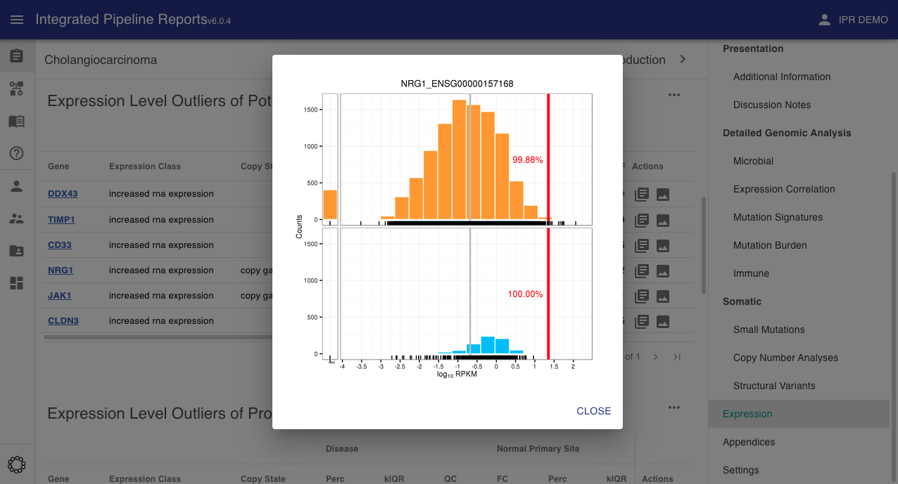

# Expression Variants

In an effort to be extensible and quick to use there are only 2 required fields for expression variants: the name of the gene (gene) and whether the expression of that gene is up-regulated or down-regulated (kbCategory).

| Field      | Type   | Example              | Description                                                                                                              |
| ---------- | ------ | -------------------- | ------------------------------------------------------------------------------------------------------------------------ |
| gene       | string | KRAS                 | the gene name (or source identifier)                                                                                     |
| kbCategory | string | increased expression | the graphkb expression variant vocabulary term this variant belongs to. One of: increased expression, reduced expression |

The kbCategory field is how IPR knows this row/entry should be treated as a variant/outlier or just expression information input for context. This way the thresholds and cut-off values used are determined by the users uploading the reports.

Computing the various expression metrics is largely optional and done prior by the user prior to upload/report-creation. These metrics are displayed to the analyst reviewing the case along with the variant status. The standard fields we provide input for are listed below.

As with the other variants, these should be passed to the IPR python adaptor in the main report content JSON.

```json
{
    "expressionVariants": [
        // variants
    ]

}
```

Each variant is an object which may contain any of the following fields (in addition to the required fields). Examples of how these fields are calculated can be found in the [scripting examples section](../../scripting/RNA_Expression_Metrics).



## Metrics

### Z-Score

The z-score (A.K.A. [standard score](https://en.wikipedia.org/wiki/Standard_score)) is a metric used to describe a data point relative to a distribution with respect to the variance within that distribution. Formally it is defined as

$$
z = \frac{\mu - x}{\sigma}
$$

### k-IQR

The k interquartile range is a used to compare a point against a distribution. It is defined as the distance of a given point from the median scaled by the interquartile range

$$
k = \frac{Q_2 - x}{Q_3 - Q_1}
$$

This metric is similar to the z-score but more robust to outliers.

### Percentile

The [percentile rank](https://en.wikipedia.org/wiki/Percentile_rank) is a non-parametric way of measuring a given data point relative to the distribution.

## Comparators

All of the standard expression metrics in IPR are expected to be calculated against a reference distribution of expression samples. To this end, IPR provides a number of fields to record which distributions were used. This ensures that the final result is interperable and reproducible. A complete list of comparators can be found in the [comparators section](../optional_analyses/comparators.md) of the user manual.

Expression comparators fall into three main groups: disease, primary site, and biopsy site.

### Disease

The reference distribution that most closely matches the diagnosis of the current sample

### Primary Site

The reference distribution that most closely matches the non-diseased/normal expression of the primary site tissue

### Biopsy Site

The reference distribution that most closely matches the non-diseased/normal expression of the biopsy site tissue. This is important for metastatic samples where the biopsy site and primary site differ.

## Images

The use can optionally include expression density plots to allow the user to view the relative expression of the current sample compared to a specific distribution.

!!! Info

    These will be passed to the report upload function via the [images section](../../optional_analyses/images) of the JSON input

key: `expDensity\.(\S+)`

In the above the pattern is expected to be `expDensity.<gene name>` where the gene name matches the gene name(s) used for the expression variant definitions. Where these plots are included for the genes listed as variants they will be shown along with the expression data in the expression variants section.


In the interface these will appear in the actions tab where available.


This will bring up the expression density plot in a popup


