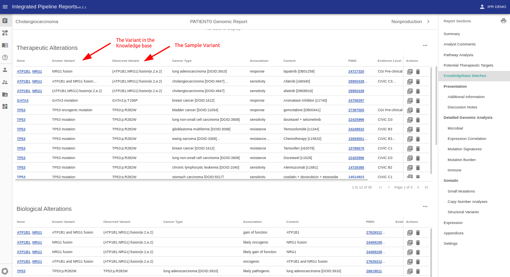
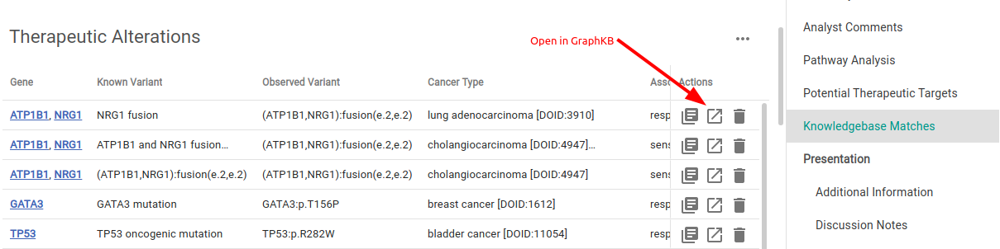

# KB Matches

The knowledge base (KB) matches section of the report is generated by the IPR python adapter during creation of a report. Any input core variants are annotated by matching against a GraphKB API instance.

## Known vs Observed Variants

As GraphKB is able to support matching non-specfic variant notation. A distinction is needed between the sample variant and the variant it was matched to by the knowledge base.

## Linking Matched Statements

The ID of the matched statement is included in the upload to facilitate direct linking to the paired GraphKB client instance (this feature is not available in the demo application).

To see the matched annotation in GraphKB with links to and/or information about the original records click the "open in new tab" icon under actions

This will bring you to the corresponding GraphKB page for the matched statement(s).

