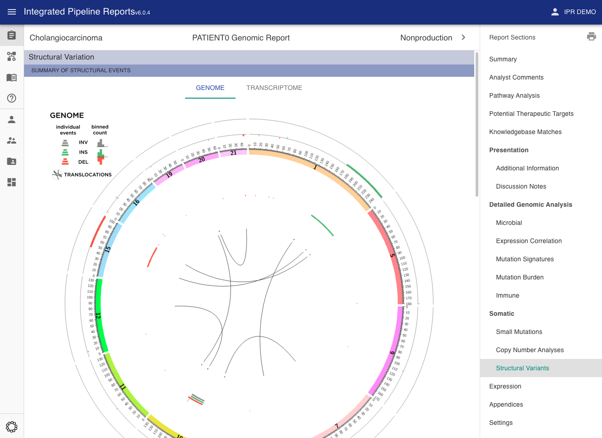

# Circos Plots

There are a number of fields for including circos plots in the report. Circos plots are a useful way to look at an overview of variants for a particular sample.

!!! Info

    These will be passed to the report upload function via the [images section](../images) of the JSON input

## Copy Number Circos Plot

key: `cnvLoh.circos`

This plot will be included in the copy variants section of the report

## Structural Variant Circos Plots

keys: `circosSv.genome`, `circosSv.transcriptome`

These plots will be included in the structural variants section of the report

## Microbial Integration Circos Plots

keys: `microbial.circos.genome`, `microbial.circos.transcriptome`

This plot has its own section, along with the microbial integration fields. It is generally used to describe viral genome integration such as HPV16.
