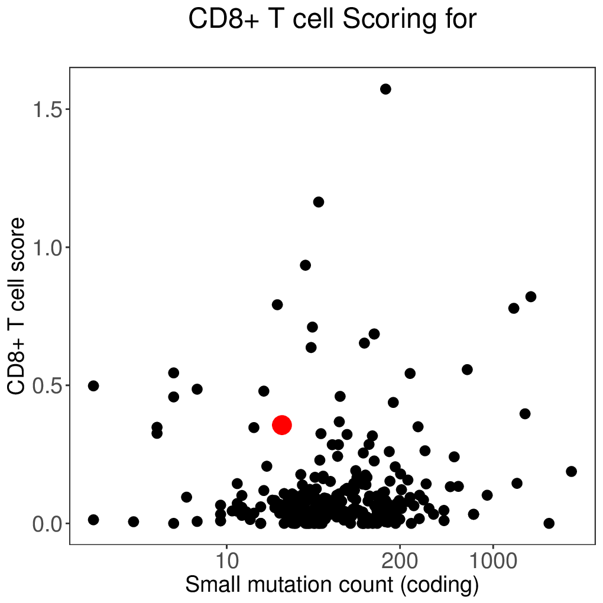

# Immune Profiling

## OptiType (HLA Types)

[OptiType publication](https://pubmed.ncbi.nlm.nih.gov/25143287/)

```json
{
    "hlaTypes": [
        {
            "pathology": "normal",
            "protocol": "DNA",
            "a1": "A*02:03",
            "a2": "A*11:01",
            "b1": "B*40:01",
            "b2": "B*38:02",
            "c1": "C*07:02",
            "c2": "C*07:02"
        }
    ]
}
```



## Cibersort (Immune Cell Types)

[Cibersort publication](https://www.nature.com/articles/nmeth.333)

```json
{
    "immuneCellTypes": {
        "cellType": "combined T cell",
        "kbCategory": "moderate",
        "score": 76,
        "percentile": 50
    }
}
```



Example cell type values are

- B cells naive
- B cells memory
- Plasma cells
- T cells CD8
- T cells CD4 naive
- T cells CD4 memory resting
- T cells CD4 memory activated
- T cells follicular helper
- T cells regulatory (Tregs)
- T cells gamma delta
- NK cells resting
- NK cells activated
- Monocytes
- Macrophages M0
- Macrophages M1
- Macrophages M2
- Dendritic cells resting
- Dendritic cells activated
- Mast cells resting
- Mast cells activated
- Eosinophils
- Neutrophils
- T.cell.inflitration

### Cibersort Images

!!! Info

    These will be passed to the report upload function via the [images section](../images) of the JSON input

key: `cibersort.cd8_positive_t-cell_scatter`



key: `cibersort.combined_t-cell_scatter`


## MiXCR

!!! Info

    These will be passed to the report upload function via the [images section](../images) of the JSON input

[MiXCR Publication](https://pubmed.ncbi.nlm.nih.gov/25924071/)

key: `mixcr.circos_trb_vj_gene_usage`


key: `mixcr.dominance_vs_alpha_beta_t-cells_scatter`


