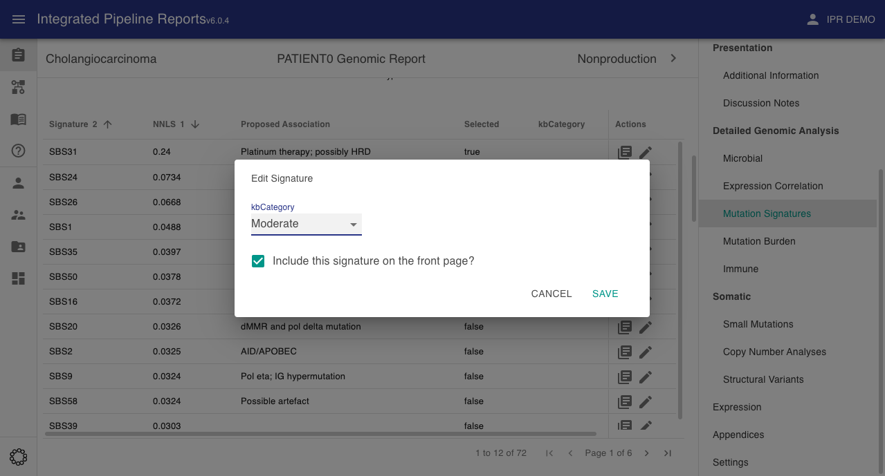

# Mutation Signatures

These are the scores of individual [mutation signatures](https://www.nature.com/articles/s41586-020-1943-3). These can include cosmic and/or custom signatures. The nnls field is the non-negative least squares contribution of the given signature

```json
{
    "mutationSignature": [
        {
            "signature": "SBS1",
            "nnls": 0.344,
            "associations": "Tobacco chewing",
            "features": "D,T",
            "numCancerTypes": 1,
            "cancerTypes": "stomach cancer",
            "selected": false,
            "kbCategory": "strong signature"
        }
    ]
}
```



The `selected` field indicates if this signature should be shown on the front page of the report or not. This field can be toggled via the client interface following upload.



## Images

!!! Info

    These will be passed to the report upload function via the [images section](../images) of the JSON input

key: `mutSignature.barplot.sbs`


key: `mutSignature.barplot.dbs`


key: `mutSignature.barplot.indels`


