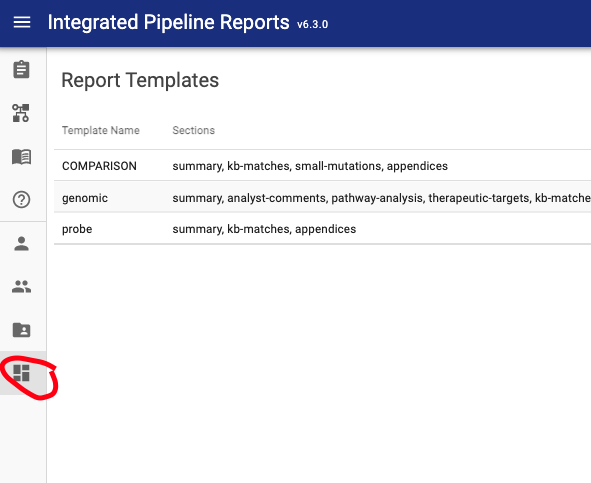
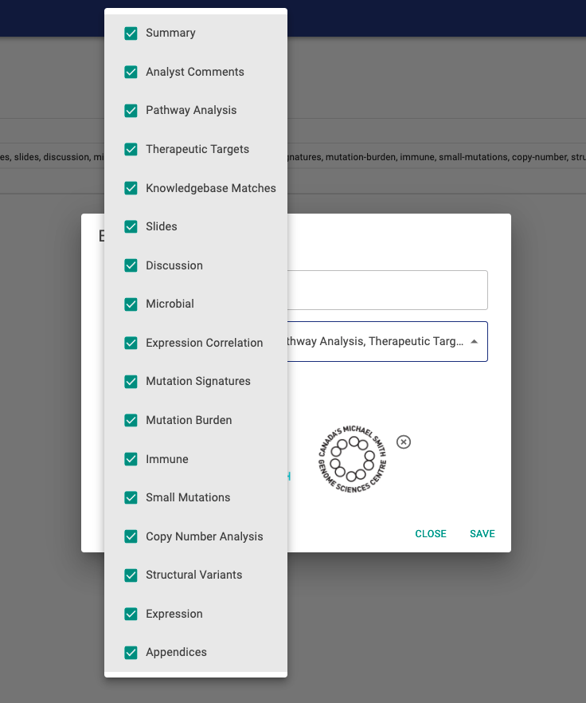

# Templates

There is a lot of optional content that can be included in a PORI report by default. However you may not have all of these different analyses depending on how your bioinformatics pipeline is set up. To faciliate this, IPR incorporates templates.

```json
{
    "template": "TEMPLATE NAME"
}
```

These tell the client (and API) what sections to expect when a report is created or displayed. Templates can be configured and created through the administrator interface in IPR client.



Editing a template allows the administrator to configure what sections should be displayed, what image should be used for the printed report header, and the name of the template.


Individual sections can be excluded or included through the checklist. As new analyses are added to the report, this list will increase.


