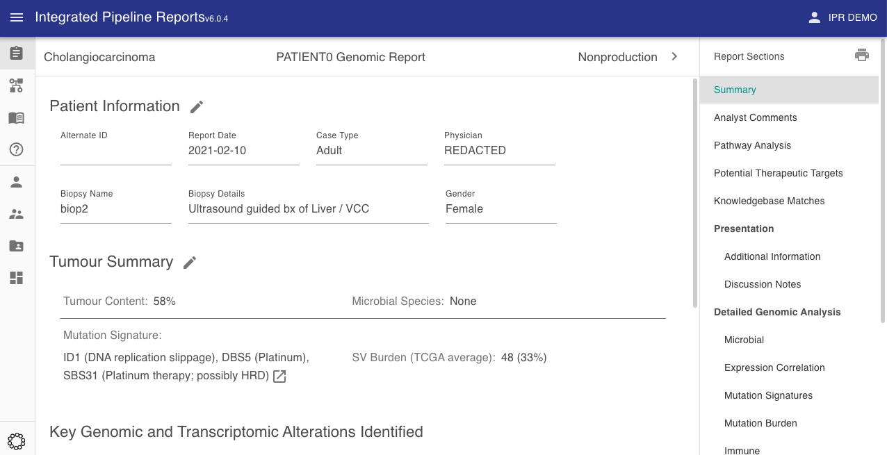
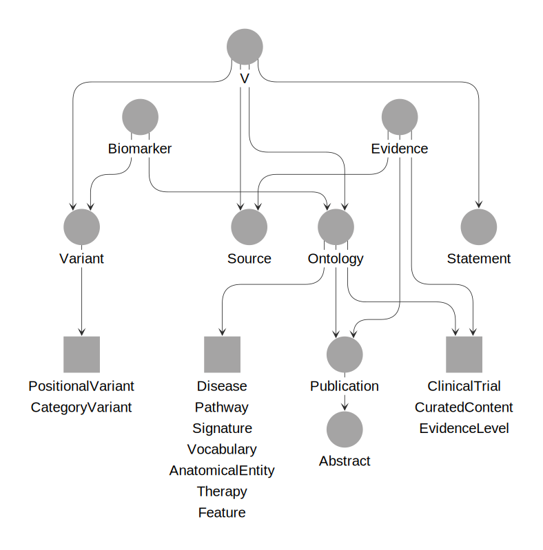

# All PORI Repositories

The platform has two main components: a graph knowledge base ([GraphKB](../graphkb)), and a reporting
application ([IPR](../ipr)). However these are modularized across several repositories listed below.

An overview of each project is given below. The projects are grouped by their type of development expertise.

## Front-End Web Development

In general our web clients are written in javascript/typescript and use [React](https://reactjs.org/), [Material-UI](https://material-ui.com), and [webpack](https://webpack.js.org).

There are two main web client projects as part of PORI

<div class='projects' markdown='1'>

- ### [GraphKB client](https://github.com/bcgsc/pori_graphkb_client)

    

    The GraphKB client is the front-end web client for the GraphKB project. The client is used to explore and manage content within GraphKB. This is the primary way for knowledgebase users to interact with GraphKB. It contains a graph-based view and support for common query operations. It also allows export of results up to 5K rows (larger exports should be done via the API).

- ### [IPR client](https://github.com/bcgsc/pori_ipr_client)

    

    The IPR client is the front-end web application which consumes data from the IPR API. The primary function is the production and management of genomic reports. Case Analysts use the IPR client to curate and review reports prior to presentation to a molecular tumour board or dissemination.

</div>

## Back-End Web Development

The REST APIs that are part of PORI are written in javascript and are run using [NodeJS](https://nodejs.org/en/). Both are built on the popular [Express](https://expressjs.com/) framework. The database and corresponding object relational mapper (ORM) is where they differ. The IPR API uses [Postgres](https://www.postgresql.org/) and [sequelize](https://sequelize.org/) whereas the GraphKB API uses [OrientDB](https://orientdb.org/) and [orientjs](https://www.npmjs.com/package/orientjs).

Both APIs implement [swagger/openapi](https://swagger.io/specification/) documentation for developers using the APIs.

<div class='projects' markdown='1'>

- ### [GraphKB API](https://github.com/bcgsc/pori_graphkb_api)

    

    GraphKB REST API and Graph Database. The GraphKB database is a graph database which is used to store variants, ontologies, and the relevance of these terms and variants. The KB uses strict controlled vocabulary to provide a parseable and machine-readable interface for other applications to build on.

- ### [IPR API](https://github.com/bcgsc/pori_ipr_api)

    

    The Integrated Pipeline Reports (IPR) REST API manages data access to the IPR database. The API is responsible for storing and server all data for reports.

</div>

## ETL / Data Loading

The GraphKB project also includes a loaders package which are used to import content from external knowledge bases and ontologies into GraphKB. Writing these loaders requires a strong understanding of the knowledge graph structure of GraphKB as well as the structure of the target resource. The loaders are written in javscript to be able to leverage the parser and schema JS packages used by the API and client. They are run with [NodeJS](https://nodejs.org/en/). A list of the popular supported inputs can be found in the [loading data section](./graphkb/loading_data.md).

<div class='projects' markdown='1'>

- ### [GraphKB Data Loaders](https://github.com/bcgsc/pori_graphkb_loader)

    

    GraphKB loaders is responsible for all data import into GraphKB. Automatic Import modules are provided for a variety of external ontologies and knowledgebases such as: Ensembl, Entrez Genes, RefSeq, HGNC, Disease Ontology, NCI Thesaurus, CIViC, DoCM, etc.

</div>

## Python Adaptors

The popularity of python in bioinformatics makes it one of the top choices for adaptors. These adaptors are written to help users integrate PORI into their existing bioinformatic workflows. They are published and installed via pip.

```bash
pip install graphkb ipr
```

A developer reference for both packages including the function signatures and package details can be found in the developer reference section [here](../developer_reference).

<div class='projects' markdown='1'>

- ### [GraphKB Python Adaptor](https://github.com/bcgsc/pori_graphkb_python)

    

    Python adapter package for querying the GraphKB API. See the related
    [user manual](../graphkb/python/docs) for instructions on incorporating
    this into custom scripts.

- ### [IPR Python Adaptor](https://github.com/bcgsc/pori_ipr_python)

    

    Python adapter for generating reports uploaded to the IPR API. This python tool takes in variant inputs as tab-delimited files and annotates them using GraphKB. The resulting output is uploaded to IPR as a report. Additional report content such as images and metadata can be passed to be included in the report upload.

- ### [PORI cBioportal](https://github.com/bcgsc/pori_cbioportal)

    

    This python adaptor is intended to demonstrate creating a PORI report using data exported from a cBioportal instance. It uses the expression, copy number, fusion, and small mutation data as well as available metadata to complete the reports.

</div>

## Other Supporting Packages

There are a number of packages that are split into separate projects so that they can be re-used across the other PORI projects. For example, the GraphKB parser is used by both the GraphKB API, the GraphKB Client, and the GraphKB data loaders.

<div class='projects' markdown='1'>

- ### [GraphKB Parser](https://github.com/bcgsc/pori_graphkb_parser)

    

    A package for parsing and recreating HGVS-like variant notation used in GraphKB. This is used by both the API and Client applications. Try it out online with [RunKit](https://runkit.com/creisle/6083062ff39ff0001b93ea6f)

- ### [GraphKB Schema](https://github.com/bcgsc/pori_graphkb_schema)

    

    The GraphKB Schema package defines the vertex and edge classes in the DB. It is used as a dependency of both the API and client applications.

</div>
